# **Create Amazing Forms**
## Introduction:
>The best forms are the ones with fewest inputs. 
The topic is about designing, validating forms and guiding the user along the way.
Efficient forms can be designed by avoiding repeated actions, asking for only the necessary information and guide users by showing them how far along they are in multi-part forms.

## Aims Of Google Forms:
* Use existing data to pre-populate fields and be sure to enable autofill.
* Use clearly-labeled progress bars to help users get through multi-part forms.
* Provide visual calendar so users don’t have to leave your site and jump to the calendar app on their smartphones.

## Minimize repeated actions and fields:
1. Forms should not have repeated fields.
2. Only use necesary fields.
3. Make atmost use of autofill.
4. Try to pre-fill fields whose data are already available. 
Ex. Pre-populate mobile number, email, shipping address from saved data.

## Show users how far along they are:
1. Convey the level of progress in multi-part forms.
2. Mark heading of each step clearly.

## Provide visual calendars when selecting dates:
1. Provide users with more context when scheduling appointments so that they don't need to 
leave the page to check calendar.

## Input Type Selection:
1. Choose the most appropriate input type for your data to simplify input.
2. Offer suggestions as the user types with the datalist element.

## HTML 5 Input Types:
1. HTML 5 has several new input types.
2. It provides different types of keyboard for various inputs, so that user feels comfortable.

- url:
    * For entering URL. It must start with a valid URI scheme, for example http://.
- tel:
    * For entering telephone numbers. Different patterns can be used to validate.
- email:
    * For entering email addresses, and hints that the @ should be shown on the keyboard by default.      You can add the multiple attribute if more than one email address will be provided.
- search:
    * A text input field styled in a way that is consistent with the platform's search field.
- number:
    * For numeric input, can be any rational integer. Additionally, iOS requires using pattern="\d*" to show the numeric keyboard.
- range:
    * For number input, but unlike the number input type, the value is less important. It is displayed to the user as a slider control.

## Labeling and naming inputs properly:
1. Always use labels on inputs, and make sure that they're visible when the field is in focus.
2. Use placeholders to provide guidance about what you expect.
3. To help the browser auto-complete the form, use established name's for elements and include the    autocomplete attribute.

Ex. 
> 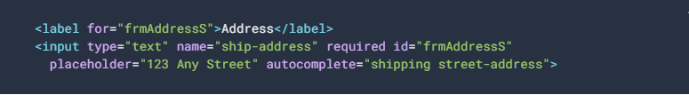

## Label Sizing and Placement:
1. Labels and inputs should be large enough.
2. In portrait view labels should be placed above and in landscape view it should be placed beside input.

## Meta-data to enable auto-complete:
1. It would be time saving for users when required fields are automatically filled.
2. Fields can be auto-populated based on the previously specified data by the user by providing both the name attribute and the autocomplete attribute on each input element.
    
Example:
> 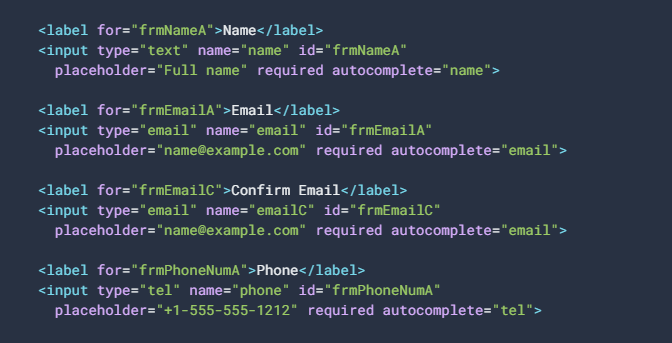

| Content Type      | Name Attribute |Autocomplete Attribute     |
| :---- | :---- | :--- |
| name      | name fname mname lname       | name given_name familyName |
| Email   | email        | email |
|Phone	| phone mobile country-code area-code exchange suffix ext| tel
|Credit Card | ccname cardnumber cvc ccmonth ccyear exp-date card-type | cc-name cc-number
|Usernames	| username | username
|Passwords	| password | curr-password new-password

## The autofocus attribute:
-  When set, desktop browsers immediately move the focus to the input field, making it easy for users to quickly begin using the form. Mobile browsers ignore the autofocus attribute, to prevent the keyboard from randomly appearing.

Ex. 
> 

## Provide real-time validation:
- Leverage the browser's built-in validation attributes like pattern, required, min, max, etc.
- Use JavaScript and the Constraints Validation API for more complex validation requirements.
- Show validation errors in real time, and if the user tries to submit an invalid form, show all fields they need to fix.

## Attributes To Validate Input:
- `pattern` attribute:
  * The pattern attribute specifies a regular expression used to validate an input field. For example, to validate a US Zip code (5 digits, sometimes followed by a dash and an additional 4 digits), we would set the pattern like this:

    > 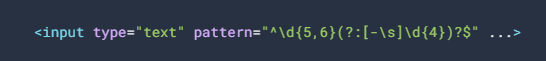

    | Regular Expressions | |
    | --- | ----------- |
    | Postal address	 | [a-zA-Z\d\s\-\,\#\.\+]+|
    |Zip Code (US) | ^\d{5,6}(?:[-\s]\d{4})?$
- `required` attribute
    * If the required attribute is present, then the field must contain a value before the form can be submitted. For example, to make the zip code required, we'd simply add the required attribute:
        > 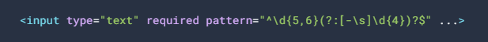
- `min`, `max` and `step` attributes:
    * For numeric input types like number or range as well as date/time inputs, you can specify the minimum and maximum values, as well as how much they should each increment/decrement when adjusted by the slider or spinners. For example, a shoe size input would set a minimum size of 1 and a maximum size 13, with a step of 0.5

        > 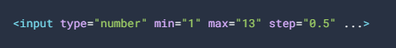
- `maxlength`, `minlength` attribute:
    * These attribute can be used to specify the maximum, min length of an input or textbox and is useful when you want to limit the length of information that the user can provide. For example,

        > 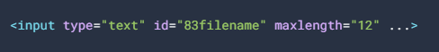
        
        > 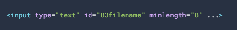
-  `novalidate` attribute:
    * In some cases, you may want to allow the user to submit the form even if it contains invalid input. To do this, add the novalidate attribute to the form element, or individual input fields. In this case, all pseudo classes and JavaScript APIs will still allow you to check if the form validates.
        > 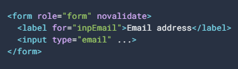
## Real Time Validation:
When the built-in validation plus regular expressions aren't enough, you can use the [Constraint Validation API](https://html.spec.whatwg.org/multipage/form-control-infrastructure.html#constraints), a powerful tool for handling custom validation. 
> 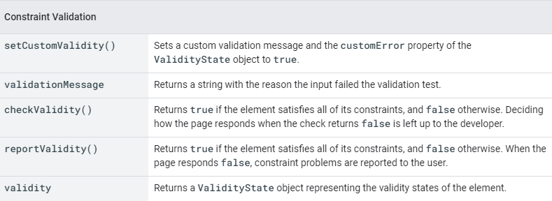
## Feedback In Real-Time:
- It's helpful to provide a visual indication on each field that indicates whether the user has completed the form properly before they've submitted the form. HTML5 also introduces a number of new pseudo-classes that can be used to style inputs based on their value or attributes.
> 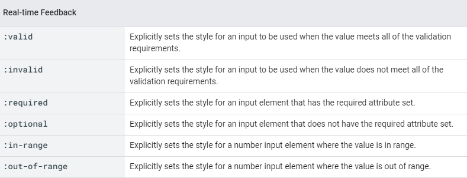
- Validation happens immediately which means that when the page is loaded, fields may be marked as invalid, even though the user hasn't had a chance to fill them in yet. It also means that as the user types, and it's possible they'll see the invalid style while typing. To prevent this, you can combine the CSS with JavaScript to only show invalid styling when the user has visited the field.
> 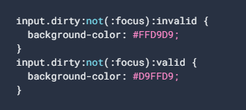