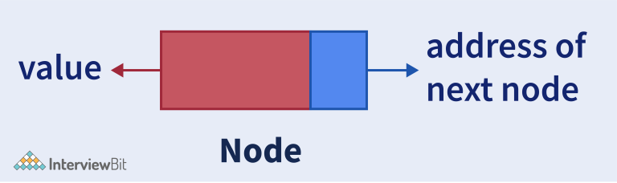
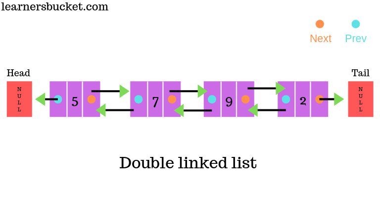

# Linked List

### _AUTHOR : THAMARAI SELVAN_

---

[Click here for session video of singly linked lists](https://drive.google.com/file/d/1qYH2uq0nN3W_yAWTioyNop_2_t7RNVbF/view?usp=sharing)

- Linked List can be defined as collection of objects called nodes that are randomly stored in the memory.
- A node contains two fields i.e. data stored at that particular address and the pointer which contains the address of the next node in the memory.
- The last node of the list contains pointer to the null.

### Node

---

## List vs Array

---

## Types of Linked List

    * Singly Linked List
    * Doubly Linked List

## Singly Linked List

---

- A singly linked list is a type of linked list that is unidirectional, that is, it can be traversed in only one direction from head to the last node (tail).

- Each element in a linked list is called a node.

- A single node contains data and a pointer to the next node which helps in maintaining the structure of the list.

- One way chain or singly linked list can be traversed only in one direction. In other words, we can say that each node contains only next pointer, therefore we can not traverse the list in the reverse direction.

## Doubly Linked List

---

- Doubly linked lists include nodes that have a data field, “next” field, and another link field “prev” pointing to the last node in the sequence.

