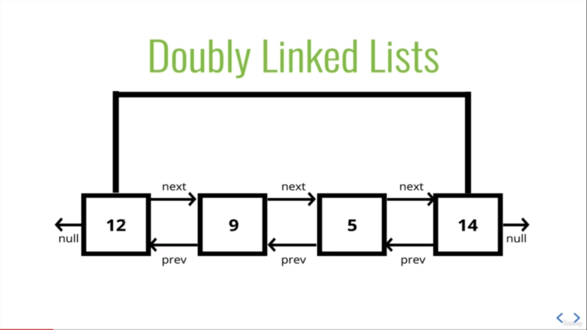

# Doubly linked list

### _AUTHOR : SANKARA GOMATHI_

---

[Click here for session video of Doubly LinkedList-part-1](https://drive.google.com/file/d/1i7-z1J81Jc4PPm9L-XYfu0MPuikS9Spz/view?usp=share_link)

---

[Click here for session video of Doubly LinkedList-part-2](https://drive.google.com/file/d/1eK3CEq5qVTDCbW6rjUx1MCYVayvalHFQ/view?usp=share_link)

---

Almost identical to a singly linked list,except every node has **another** pointer,to the **previous** node!



- **Prev:** Each link of linked list has a link to the previous node called Prev.
- **Next:** Each link of linked list has a link to the next node called Next
- **Link:** Each link of linked list can store data, known as element.
- **Linked List:** It contains the connection link to the first link and the last link.

## Comparisons of Singly Linked Lists

### More memory === More Flexbility. It's **almost** always a tradeoff !

## The node definition is as follows ,

#### The pointers are represented using **this.next** and **this.prev** for each node.

```class
class Node{
    constructor(val){
        this.val = val;
        this.next = null;
        this.prev = null;
    }
}


class DoublyLinkedList {
    constructor(){
        this.head = null;
        this.tail = null;
        this.length = 0;
    }
}
```

## Doubly linked list Methods :

| Add           | Remove             |
| ------------- | ------------------ |
| Add to Head   | Remove from Head   |
| Add to Middle | Remove from Middle |
| Add to Tail   | Remove from Tail   |

## PUSHING

#### Adding a node to the **end** of the Doubly Linked List.

```class
push(val){
        var newNode = new Node(val);
        if(this.length === 0){
            this.head = newNode;
            this.tail = newNode;
        } else {
            this.tail.next = newNode;
            newNode.prev = this.tail;
            this.tail = newNode;
        }
        this.length++;
        return this;
    }
```

## POPING

Removing a node to the **end** of the Doubly Linked List.

```class
 pop(){
        if(!this.head) return undefined;
        var poppedNode = this.tail;
        if(this.length === 1){
            this.head = null;
            this.tail = null;
        } else {
            this.tail = poppedNode.prev;
            this.tail.next = null;
            poppedNode.prev = null;
        }
        this.length--;
        return poppedNode;
    }
```

## SHIFTING

Removing a node from the **beginning** of the Doubly Linked List

```class
  shift(){
        if(this.length === 0) return undefined;
        var oldHead = this.head;
        if(this.length === 1){
            this.head = null;
            this.tail = null;
        }else{
            this.head = oldHead.next;
            this.head.prev = null;
            oldHead.next = null;
        }
        this.length--;
        return oldHead;
    }
```

## UNSHIFTING

Adding the node from **beginning** of the doubly linked list

```class
 unshift(val){
        var newNode = new Node(val);
        if(this.length === 0) {
            this.head = newNode;
            this.tail = newNode;
        } else {
            this.head.prev = newNode;
            newNode.next = this.head;
            this.head = newNode;
        }
        this.length++;
        return this;
    }
```

## GET

Accessing the node in a doubly linked list by its position

```class
get(index){
        if(index < 0 || index >= this.length) return null;
        var count, current;
        if(index <= this.length/2){
            count = 0;
            current = this.head;
            while(count !== index){
                current = current.next;
                count++;
            }
        } else {
            count = this.length - 1;
            current = this.tail;
            while(count !== index){
                current = current.prev;
                count--;
            }
        }
        return current;
    }
```

## SET

Replacing the value of the node to the in a doubly linked list

```class
 set(index, val){
        var foundNode = this.get(index);
        if(foundNode != null){
            foundNode.val = val;
            return true;
        }
        return false;
    }
```

## INSERT

Adding a node in a doubly linked list by a certain position.

```class
 insert(index, val){
        if(index < 0 || index > this.length) return false;
        if(index === 0) return !!this.unshift(val);
        if(index === this.length) return !!this.push(val);

        var newNode = new Node(val);
        var beforeNode = this.get(index-1);
        var afterNode = beforeNode.next;

        beforeNode.next = newNode, newNode.prev = beforeNode;
        newNode.next = afterNode, afterNode.prev = newNode;
        this.length++;
        return true;
    }
```

## REMOVE

**Removing** a node in a doubly linked list by a certain position.

```class
remove(index){
         if(index < 0 || index >= this.length) return undefined;
        if(index === 0) return this.shift();
        if(index === this.length-1) return this.pop();
        var removedNode=this.get(index);
        var beforeNode=removedNode.prev;
        var afterNode=removedNode.next;
        beforeNode.next=afterNode;
        afterNode.prev=beforeNode;
        removedNode.next=null;
        removedNode.prev=null;
        this.length--;
        return removedNode;

    }
```

## Big O of Doubly linked lists

- Insertion - O(1)
- Removal - O(1)
- Searning - O(n) or 0(n/2)
- Access - O(n)
