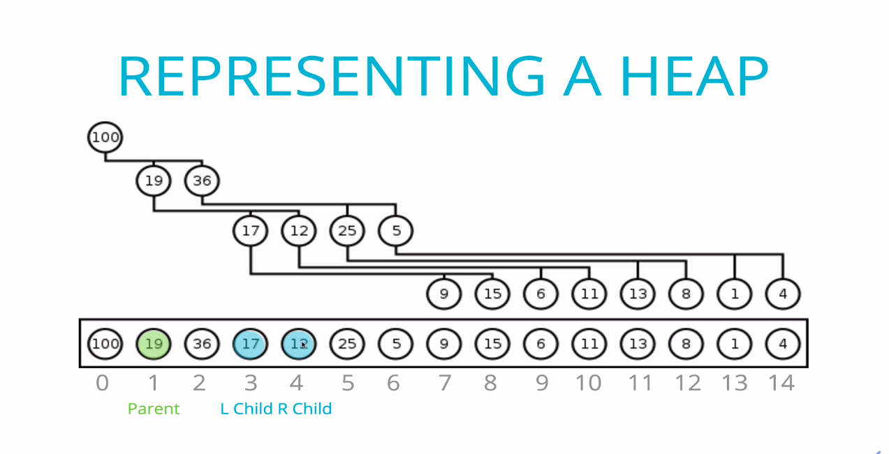

# Binary Heaps in JavaScript

### _AUTHOR : LOGESH_

---

[Click here for session video of Binary Heaps](https://drive.google.com/file/d/1EiAqygA2WQTX-nRPF_cjgNUxj5zvW-ra/view?usp=sharing)

- A binary heap is a heap data structure that takes the form of a binary tree.

- The Binary Heap is a more complex data structure to implement from scratch. Having said that, it's widely used in various algorithms such as:
  - Graph Traversal
  - Sorting
  - Path-Finding

## What is a binary heap ?

- Very similar to a binary search tree, but with some different rules!.
- In a `MaxBinaryHeap`, parent nodes are always larger then child nodes.
- In a `MinBinaryHeap`, parent node are always smaller then child nodes

### Max Binary heap:


### Min Binary heap:


### Not binary heap:

- It's not a binary heap. It is a complete binary tree.


## Max Binary Heap:

- Each parent has at most two child nodes
- the value of each parent node is `always greater then` its child nodes
- In a max binary heap the parent is greater then the children but there are `no guarantess between sibling` nodes.
- A binary heap is as compact as possible. All the children of each node are as full as they can be and `left children are filled out first`.





## Storing Heaps

```javascript
example :
array values:  [100 ,19, 36, 17, 12, 25, 5, 9, 15, 6, 11, 13, 8 , 1 , 4]

let node = 0
//left child stored at 2n + 1
let leftNode = 2*0 + 1
             = 1 //1st index stored value 19

//right child stored at 2n + 2
let rightNode = 2*0 + 2
             = 2 //2nd index stored value 36

//find parent index - (n-1)/2
let parent = (2-1)/2
           = 2 //2nd index value 36
```


## Insert heaps :

```javascript
class MaxBinaryHeap {
  constructor() {
    this.values = [];
  }

  insert(element) {
    this.values.push(element);
    this.swap();
  }

  swap() {
    let idx = this.values.length - 1;
    let element = this.values[idx];
    while (idx > 0) {
      let parentIdx = Math.floor((idx - 1) / 2);
      let parent = this.values[parentIdx];
      if (element <= parent) break;
      this.values[parentIdx] = element;
      this.values[idx] = parent;
      idx = parentIdx;
    }
  }

  show() {
    console.log(this.values);
  }
}

var newMinHeap = new MaxBinaryHeap();

newMinHeap.insert(36);
newMinHeap.insert(63);
newMinHeap.insert(3);
newMinHeap.insert(13);
newMinHeap.insert(93);
newMinHeap.show();

//[ 36, 63, 3, 13, 93]
//  0   1   2   3   4  ---index

// [63, 36, 3, 13, 93]
// [63, 93, 3, 13, 36]
// [93, 63, 3, 13, 36]

// result = [93, 63, 3, 13, 36]
```

## Removing from heap

```javascript
class MaxBinaryHeap {
  constructor() {
    this.values = [];
    this.selector;
  }
  insert(element) {
    this.values.push(element);
    this.swap();
  }
  swap() {
    let idx = this.values.length - 1;
    let element = this.values[idx];

    while (idx > 0) {
      let parentIdx = Math.floor((idx - 1) / 2);
      let parent = this.values[parentIdx];
      if (element <= parent) break;

      this.values[parentIdx] = element;
      this.values[idx] = parent;
      idx = parentIdx;
    }
  }
  extractMax() {
    let max = this.values[0];
    let end = this.values.pop();

    if (this.values.length > 0) {
      this.values[0] = end;
      this.swapDown();
    }
    return max;
  }
  swapDown() {
    let idx = 0;
    let length = this.values.length;
    let element = this.values[0];

    while (true) {
      let leftChildIdx = 2 * idx + 1;
      let rightChildIdx = 2 * idx + 2;
      let leftChild, rightChild;
      let swap = null;

      if (leftChildIdx < length) {
        leftChild = this.values[leftChildIdx];
        if (leftChild > element) {
          swap = leftChildIdx;
        }
      }
      if (rightChildIdx < length) {
        rightChild = this.values[rightChildIdx];
        if (
          (swap === null && rightChild > element) ||
          (swap !== null && rightChild > leftChild)
        ) {
          swap = rightChildIdx;
        }
      }
      if (swap === null) break;
      this.values[idx] = this.values[swap];
      this.values[swap] = element;
      idx = swap;
    }
  }
  show() {
    console.log(this.values);
  }
}
let newMinHeap = new MaxBinaryHeap();
newMinHeap.insert(36);
newMinHeap.insert(63);
newMinHeap.insert(3);
newMinHeap.insert(103);
newMinHeap.insert(13);
newMinHeap.insert(93);
newMinHeap.insert(100);
newMinHeap.show();
newMinHeap.extractMax();
newMinHeap.show();

//[ 103, 63, 100, 36, 13, 3, 93]

// [ 100, 63, 93, 36, 13, 3 ]
```
