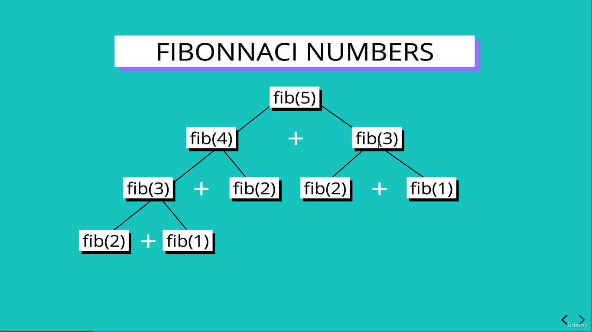

# Dynamic Programming

### _AUTHOR : SANKARA GOMATHI_

---

[Click here for session video of Dynamic Programming](https://drive.google.com/file/d/1c9BZWircl9F2z4Kcr_sO64oMFw6AievM/view?usp=share_link)

"A method for solving a complex problem by breaking it down into a collection of simpler sub problems, solving each of those sub problems just once and storing their solutions."

## Objectives :

- Define What is Dynamic programming is
- Explain what overlopping subproblems are
- Understand what optimal substructure is
- Slove more challenging problems using dynamic programming

## It only workS on problem with...

- OPTIMAL SUBSTRUCTURE &
- OVERLAPPING SUBPROBLEMS

## Overlapping subproblems

A problems is said to have **Overlapping subproblems** if it can be **broken to be down into subproblems**.Which are used **serveral times**.

Example for the Fibonacci sequence

Fibonacci sequence:
"Every number after the first two is the sum of the two preceding once"

**(E.X)**



## Optimal Substructure

A problems is said to be have **optimal substructure** if an optimal solution can be construced from optimal solution of its subproblems.

## Recursive Solution of fibonnaci

Recursive Solution for fibonnaci

```
function fib(n){
   if(n<=2) return 1;
   return fib(n-1) + fib(n-2);
}
```


## Big O notation of recursive solution of fibonnaci O(2^ n)

## Memoization

Storing the result of expensive function call and retuning the cached result when the same inputs occur again

```
function fib(n,memo=[]) {
    if(memo[n]!== undefined) return memo[n]
    if(n<=2) return 1
    var res=fib(n-1,memo)+ fib(n-2,memo)
    memo[n]=res
    console.log(memo,"MEMO")
    return res
}
```

Memoization of fibonnaci Big O natation is **O(N)**

## Tabulation

Storing the result of a previous value result in a table (using in array) usually done using **iteration**
Better **space complexity** can be achieved using tabulation.

```
function fib_table(n){
   if(n<=2) return 1
   var fibNum=[0,1,1]
   for (var i=3;i<=n;i++) {
       fibNum[i]=fibNum[i-1]+fibNum[i-2]
   }
return  fibNum[n]
}

```

tabulation of Big O natation **O(N)**
