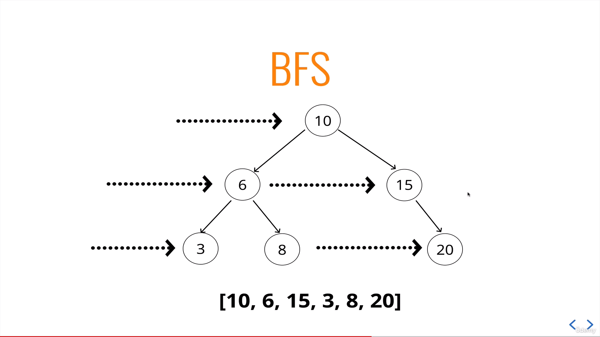
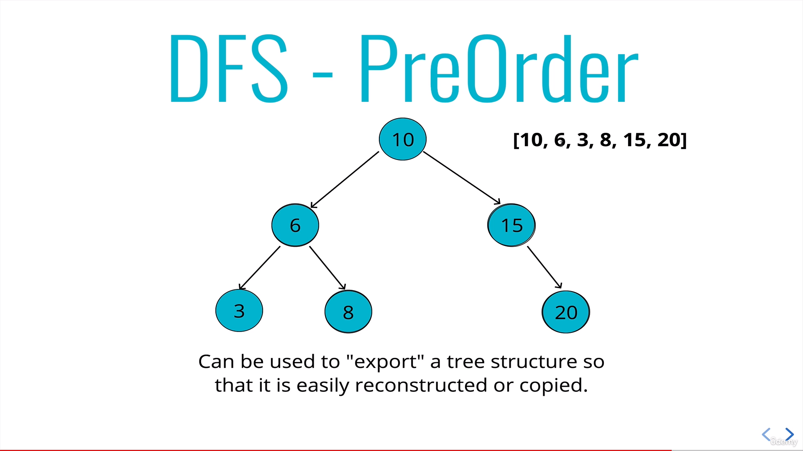
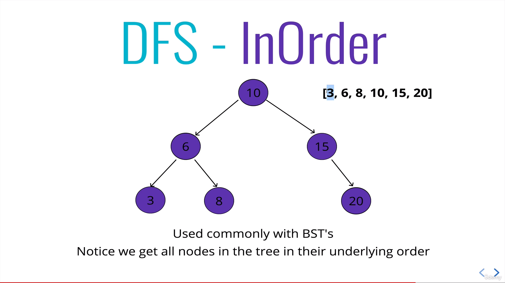

# Tree Traversal

> ### _AUTHOR : HARSHA V_

---

`Traversal is the process of visiting each and every points in a path. Similarly tree traversal refers to the process of visiting each node of a tree.`

---

<br/>

[Click here for the session video of tree traversal!](https://drive.google.com/file/d/1xoSGGcHGADmUMzUmn4jcJILVt-lVYWpy/view?usp=sharing)

### **General Application:**

- ### Traversing through an tree for all it's operations.

<br/>

### **Types Of Tree Traversals:**

### 1. Breadth-First Search (Horizontal Search):

    It refers to the process of traversing a tree horizontally.



```js
BFS(){
        var node = this.root,
            data = [],
            queue = [];
        queue.push(node);

        while(queue.length){
           node = queue.shift();
           data.push(node.value);
           if(node.left) queue.push(node.left);
           if(node.right) queue.push(node.right);
        }
        return data;
    }
```

### 2. Depth-First Search (Vertical Search):

    It refers to the process of traversing through a tree vertically.

    DFS includes three types namely:
        - Pre-Order DFS
        - In-Order DFS
        - Post-Order DFS

<br/>

### **_Pre-Order DFS:_**

    As the name specifies, in pre order traversal, the root node will be visited first, followed by the left nodes and the the right node.



```js
DFSPreOrder(){
        var data = [];
        function traverse(node){
            data.push(node.value);
            if(node.left) traverse(node.left);
            if(node.right) traverse(node.right);
        }
        traverse(this.root);
        return data;
    }

```

### Uses:

    * Used for searching an element in BST.
    * Used by databases for traversing indices of B-tree during search.

### **_In-Order DFS:_**

    In this method, the nodes that are in left to the root node are visited first , followed by the root node and then the right nodes will be traversed.



```js
DFSInOrder(){
        var data = [];
        function traverse(node){
            if(node.left) traverse(node.left);
            data.push(node.value);
            if(node.right) traverse(node.right);
        }
        traverse(this.root);
        return data;
    }
```

### Uses:

    * Retrieve the sorted items of BST in ascending order.
    * It can also be used to sort a BST in descending order just by changing the order of left and right nodes in the code.

### **_Post-Order DFS:_**

    It works in a way just opposite to pre-order.It means that the left and right nodes will be visited followed by the root node.

```js
DFSPostOrder(){
        var data = [];
        function traverse(node){
            if(node.left) traverse(node.left);
            if(node.right) traverse(node.right);
            data.push(node.value);
        }
        traverse(this.root);
        return data;
    }
```

### Uses:

    * Languages which don’t have inbuilt garbage collection.
    * Reverse Polish Notation.

### **Big O Notation:**

    - BFS - O(n)*
    - DFS - O(n)*

        * Time taken for traversing the tree equals the number of nodes present in the tree.
