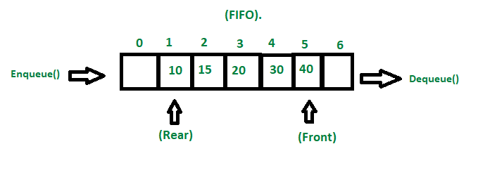

# Data Structure

### _AUTHOR : THAMARAI SELVAN_

---

[Click here for session video of Data Structure introduction ](https://drive.google.com/file/d/1k5hZhxNS8lxvldgBRaQW-b6TrggMojLi/view?usp=sharing)

    * A data structure is a specialized format for organizing, processing, retrieving and storing data.

    * There are several basic and advanced types of data structures, all designed to arrange data to suit a specific purpose.

    * Data structures make it easy for users to access and work with the data they need in appropriate ways.

    * Most importantly, data structures frame the organization of information so that machines and humans can better understand it.

## What do they do?

    Data structures are collection of values, the relationships among them, and the functions or operations that can be applied to the data

## Different types of data structures

| Linear Data Type                                                                                                                                     | Non-Linear Data Type                                                                 |
| ---------------------------------------------------------------------------------------------------------------------------------------------------- | ------------------------------------------------------------------------------------ |
| In a linear data structure, data elements are arranged in a linear order where each and every element is attached to its previous and next adjacent. | In a non-linear data structure, data elements are attached in hierarchically manner. |
| In linear data structure, single level is involved.                                                                                                  | Whereas in non-linear data structure, multiple levels are involved.                  |

---

### Linear data structure

---

- Array
  - Hash Tables
- linked List
  - Singly Linked Lists
  - Doubly Linked Lists
- Stacks
- Queues

### Non-linear data structure

---

- Trees
  - Binary Search Trees
  - Tree Traversal
  - Binary Heaps
- Graphs
  - Graph Traversal
  - Dijsktra's Algorithm

## Overview

---

### Use case of Hash Tables

- A hash table is a data structure that you can use to store data in key-value format with direct access to its items in constant time.

### Use case of Linked List

- It is a data structure consisting of a collection of nodes which together represent a sequence and helps to create ordered list with fast inserts/removals at the beginning and end.

### Use Case of Queues

- Queue is used when things don’t have to be processed immediately, but have to be processed in First In First Out order.

### Use case of Stacks

- A Stack is a linear data structure that holds a linear, ordered sequence of elements. A Stack works on the LIFO process (Last In First Out), i.e., the element that was inserted last will be removed first.

### Use case of Trees

- Tree like data structure consisting of a collection of nodes such that each node of the tree stores a value and a list of references to other nodes (the “children”).
- Mostly used on Web scraping nested HTML from website based on airline data and hotel data based on the priority

### Use case of Graph

- Graph data structure works in a way where edges connect any two nodes in the graph, and the nodes are also known as vertices.

- Graphs are used every day through Google Search, Google Maps, GPS, and social media. They are used to represent elements that share connections.

