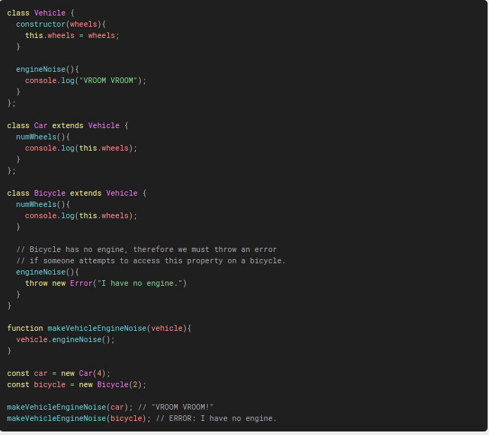

# SOLID principles in React

Good code is, in general, characterised by being a mixture of three things :

## `Functional`

The code comes together to create the desired functionality.

## `Maintainable`

It is easy to make alterations, to add new features, and for other developers to understand how the code functions.

## `Robust`

The software is hard to break due to a great test suite, and handles errors appropriately when they happen.

## What is SOLID?

**SOLID** is an acronym for five separate design principles:

- Single Responsibility Principle **(SRP)**.
- Open/Closed Principle **(OCP)**.
- Liskov Substitution Principle **(LSP)**.
- Interface Segregation Principle **(ISP)**.
- Dependency Inversion Principle **(DIP)**.

## Single Responsibility Principle (SRP)

**Every function/class/component should do exactly one thing.**

"A function does one thing if you cannot meaningfully extract another function from it. If a function contains code, and you can extract another function from it, then that original function did more than one thing." - `Robert C Martin.`

### Using this in React :

**`without principle :`**

**`with principle :`**

**TodoPage**

`<TodosPage />` doesn't care about the todos, how they are retrieved, or how they are formatted. It just knows it needs to display a page which will contain them.

**API Wrapper**

`<APIWrapper />` doesn't care about formatting anything or the todos. It just deals with retrieving them and sending them over the TodosList.

**TodoList**

`<TodosList />` doesn't care about where the todos came from, it just knows it gets a list of todos and should display some area to render them in.

**TodoItem**

`<TodoItem />` doesn't care about how many todos there are, where they came from, or on what page they will be displayed. It just knows it will receive an `id` and `title`, and should return a `<li>` containing that information.

**_`Use a combination of separate components and custom hooks to modularise larger components.`_**

**Combination with hook**

## Open/Closed Principle (OCP)

### Formal definition

**software entities (classes, modules, functions, etc.) should be open for extension, but closed for modification**

### Informal definition

**You should be able to add functionality to some module, without modifying its existing source code**

> note : You should aware of both Inheritance and Composition. (use below links)

- [reference link_1](https://javascript.plainenglish.io/inheritance-is-a-vs-composition-has-a-in-javascript-98fb96dfa0e6)
- [reference link_2](https://www.programiz.com/javascript/inheritance#:~:text=Inheritance%20enables%20you%20to%20define,feature%20that%20allows%20code%20reusability.)

### Using this in React :

**`without principle :`**

`<FancyInputBox />` (our component becomes closed for extension).

**`with principle :`**

`<FancyInputBox />` (our component is open for extension).

> Use composition to make large components, rather than extending from other components.

## Liskov Substitution Principle (LSP)

### Formal definition

- **Make classes substitutable for subclasses.**
- **If B extends A, anywhere you use A you should be able to use B.**

### Informal definition

**When extending a class or implementing an interface,my new class must be able to be used everywhere the parent class or interface is used without unexpected consequences / side effects.**

### Using this in React :

**`without principle :`**

**`with principle :`**

> If you're extending from a class, make sure the base class is as generic as needed to be a true representation of every subclass.

## Interface Segregation Principle (ISP)

### Formal definition

- **Don't make a component rely on props it doesn't care about.**
- **Many client specific interfaces are better than one general-purpose interface.**

### Informal definition

- **Only pass a component props it needs.**
- **A client should only have knowledge of the methodsit is actually going to need.**

### Using this in React :

**`without principle :`**

we have broken our `<DisplayUser />` component as props.user.name is undefined!

**`with principle :`**

> Destructure out the needed props for a component if possible. This way, the component does not rely on the details in its parent component.

### React vs ReactDOM

- The seperation of React and ReactDOM into different packages is a large-scale implementation of this principle.
- React is responsible for the Virtual DOM and translating JSX,while ReactDOM does the heavy lifting of DOM manipulation.

## Dependency Inversion Principle (DIP)

- **High-level code shouldn't depend on implementation details - always use an abstraction.**
- **The DIP tells us that we should `"hide the wiring behind the wall"` by always interacting with low-level details via abstractions.\*\***
- **This has strong ties to the `SRP` and the `ISP` detailed above.**

### Layers of abstraction

> Note : "There is a fundamental rule for functions: every line of the function should be at the same level of abstraction, and that level should be one below the function name." - `Robert C Martin.`

### Using this in React :

**`without principle :`**

**TodosPage :**

we have many implementation details buried within `<TodosPage />`.

**`with principle :`**

> "This is rude! The programmer is taking you from the heights [high-level concepts] to the depths [low-level concepts] in one line.".

**`Short notes :`**

- **SRP** : Every function/class/component should do exactly one thing.
- **OCP** : You should be able to add functionality to some module, without modifying its existing source code (prefer composition to inheritance).
- **LSP** : If B extends A, anywhere you use A you should be able to use B.
- **ISP** : Don't make a component rely on props it doesn't care about.
- **DIP** : High-level code shouldn't depend on implementation details - always use an abstraction.
