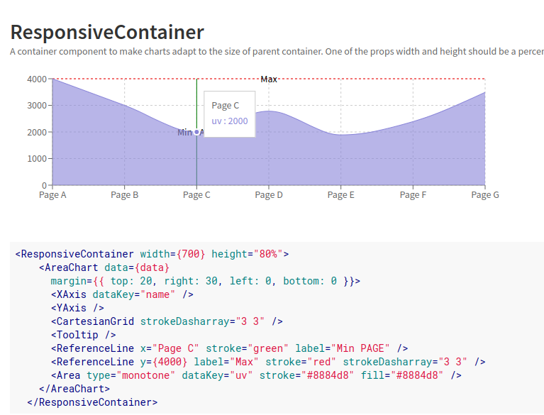
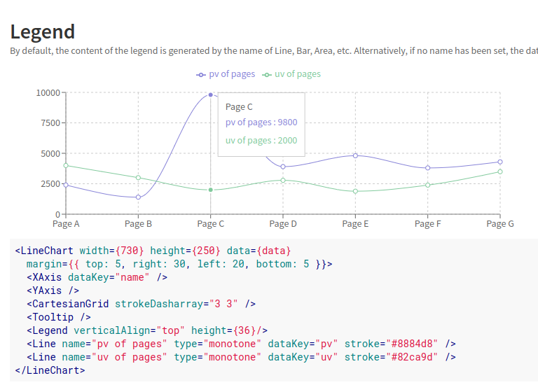
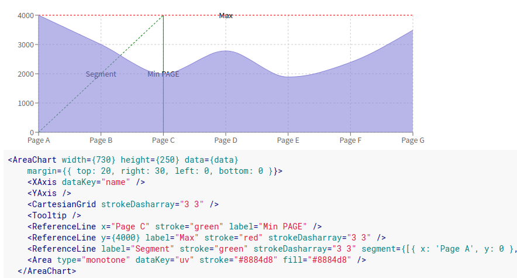
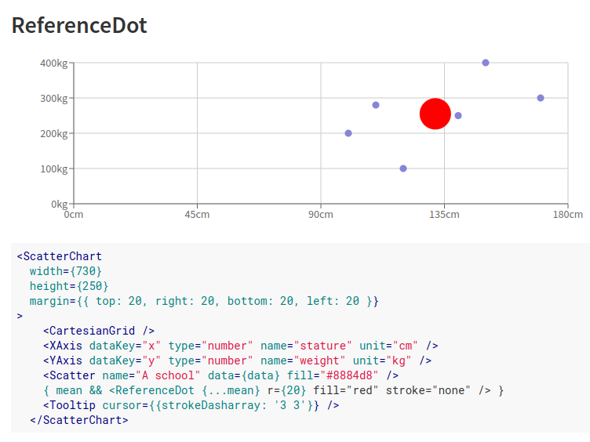
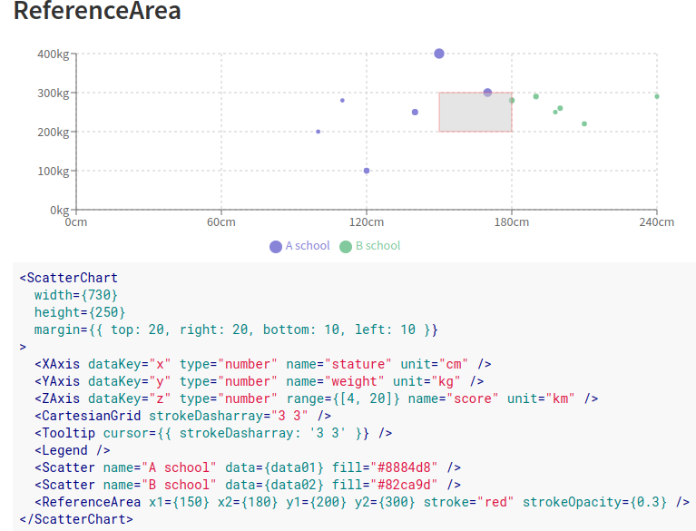

# RECHARTS

| Author | Source | Date | Estimated Time |
| --- | ----------- | ----- | --|
| Harsha V	 | Google| 10/05/2022 | 1hr

> Recharts is a composable charting library built on React components.Recharts makes it easy to integrate charts into your React application with it's evident features like composability, reliability and powefulness.

## Installation:
> npm install recharts

 - Recharts provides us with several kind of charts that help us to build a completely flexible chart with dynamic data and interactions.
 - The various types of charts provided by recharts are:

 > - Area chart
 > - Bar chart
 > - Line chart
 > - Composed chart
 > - Pie chart
 > - Radar chart
 > - Scatter chart
 > - Funnel chart
 > - Tree Map
 > - Sankey chart

 There are different kinds of components which aid us to add data and make the chart more readable and interactive. Some of such components are briefly explained below.

 ## General Components:
 ### Responsive Container:
- A container component to make charts adapt to the size of parent container.
- We should provide width and height props to this component which in turn determines the width and height of the charts contained by this container.
- Either the width or height should be provided in percentage.
- ### Child Components:
  The components that are contained in responsive container are called it's child components and they are the various chart types that are mentioned above.
- ### Properties:
  The props that can be passed to a responsive container are:
  1. aspect
  2. width
  3. height
  4. minWidth
  5. minHeight

  
### Legend:
By default, the content of the legend is generated by the name of Line, Bar, Area, etc. Alternatively, if no name has been set, the dataKey will be used to generate legend content.
- ### Parent Components:
    Legend can be used inside all the chart component types that are mentioned above earlier.
- ### Properties:
  Some of the important properties are,
  1. width
  2. height
  3. layout
  4. align etc.

  
### Tooltip:
  It is used to make the charts more readable by showing the name and value at each point on the chart while hovering on it.

- ### Parent Components:
    Similar to legend, tooltip also should be wrapped by the differnet types of charts that we saw earlier.
 - ### Properties:
   1. sperator
   2. offset
   3. itemStyle
   4. contentStyle etc.

## Cartesian Components:
 Cartesian components are the significant components that represents the base of recharts. These components are the interactive and readable part of recharts charts.

 - ### Area, Line, Bar:
    - These components are used to render either an area or line or bar graph of the rechart.
    - There can be any number of line, area and bars inside a chart and they can be stacked as per the users requirement.
    - We can also design a composed chart with all these graphs together in a single chart.
    - ### Parent Component:
      1. AreaChart/ BarChart/ LineChart
      2. Composed Chart
    - ### Properties:
        Some of the common properties of these components include,

        - datakey
        - xAxisId
        - yAxisId
        - stackId
        - label
        - data
        - activeDot
        - connectNulls etc.
        
        Further several props are available for each of the above mentioned components which can be found in the API section of original documentation.
- ### XAxis, YAxis, ZAxis:
    - These components define the x,y,z co-ordinates of a particular chart in recharts.
    - Each axis and it's data can be modified using different porps of these components.

    - ### Parent Component:
      - Area chart
      - Line chart
      - Bar chart
      - Scatter chart
    - ### Properties:
      The common properties of these components are,
      
      - hide
      - dataKey
      - width
      - height
      - orientation
      - type
      - tick
      - domain etc.

- ### Cartesian Grid:
    This refers to the grid lines that are found inside the chart. These lines represent data levels in increasing/decreasing steps, which helps us to interpret graph's trends more easily.

    - ### Parent Component:
      - Area chart
      - Line chart
      - Bar chart
      - Scatter chart
    - ### Properties:
      - x
      - y
      - horizontal/vertical
      - horizontal points/vertical points
      - strokeDashArray
- ### Reference Line, Reference Dot, reference Area:
    It determines the relationship between two axes at a particualr point.

    - ### Properties:
      - x/y
      - xAxisId/yAxisId
      - xAxis/yAxis
      - alwaysShow
      - label
      - isFront
      - strokeWidth

    

    

    

